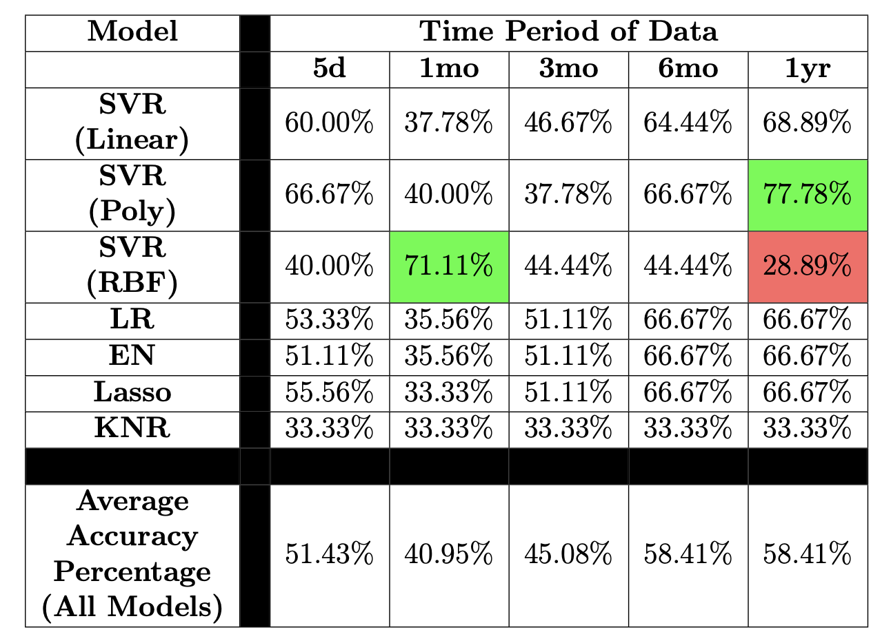
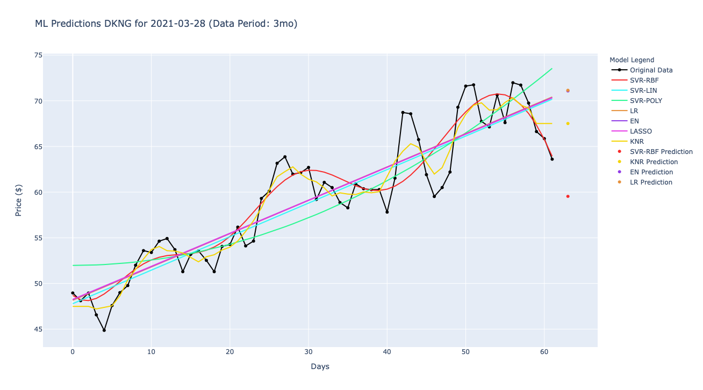
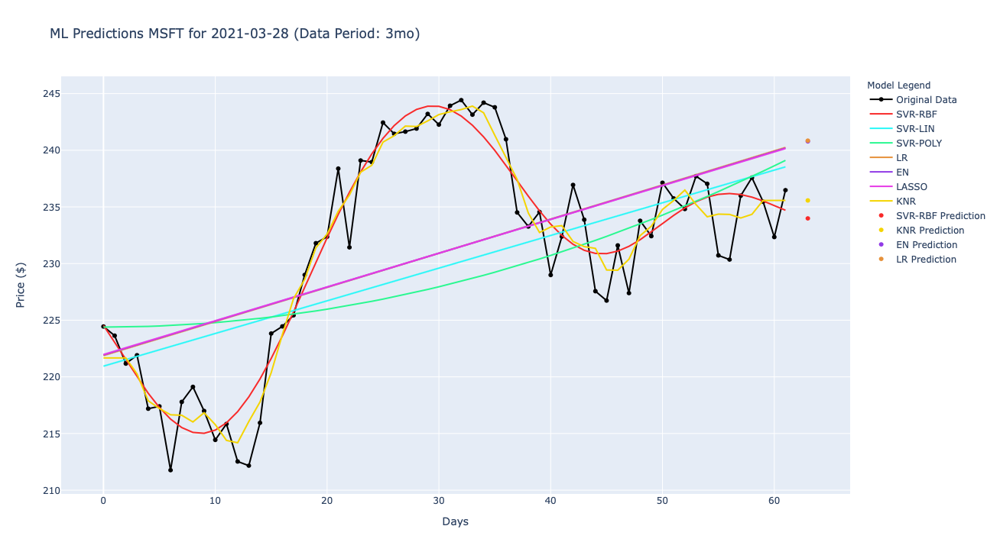

# StockSwingPredictor
The StockSwingPredictor (SSP) is a  tool that will predict stock price swings using seven different machine learning models. Implemented in Python as apart of my Allegheny College Senior Thesis.


[](https://www.python.org/)

## Table of Contents

- [About](#about)
- [Features](#features)
- [Model and Data Size Recommendations](#model-and-data-size-recommendations)
- [Running the Project](#running-the-project)
   - [Running with local Python installation](#running-with-local-python-installation)
   - [Running with Docker](#running-with-docker)
- [Testing The Project](#testing-the-project)
- [Preliminary Prediction Results](#preliminary-prediction-results)
- [Future Work](#future-work)
- [Contributing](#contributing)
- [Contact](#contact)

## About

This project predicts stock price swings (whether a price will "swing" up or down tomorrow) and was created by me, Christian Lussier, as apart of my undergraduate Senior Thesis at Allegheny College. After completing extensive research in the area of stock prediction, I implemented the Stock Swing Predictor Tool. Featuring a Streamlit web interface, users can have the tool make stock price swing predictions using seven different models. These include three different types of Support Vector Regression models, a K-Neighbors Regressor model, and a Linear Regression model. Users can enter their stock ticker symbols and preferred amount of training data, then the tool will scrape the historical stock price data and make price swing predictions using the aforementioned models. The models price predictions, price swing predictions, coefficient of determination scores, and efficiency times are outputted to the users.

View a video about the project and a general abstract [here](https://symposium.foragerone.com/richard-j-cook-teresa-m-lahti-scholars-symposium/presentations/28799).

## Features
There are a number of different features offered by the tool:
- Scrapes the amount of historical stock price data specified by the user
- Trains 7 models using scraped data, then makes price swing predictions
   - *Models:* SVR-RBF, SVR-Linear, SVR-Polynomial, Linear Regression, Elastic Net, Lasso, K-Neighbors Regressor
- User can chose to use either a command-line or web app interface
  - Both interfaces graphically display how accurate models were in predicting the prices of historical days
  - Both interfaces allow users to view the following results in a tabular format: future price swing predictions, future price predictions, model coefficient of determination scores, model efficiency times
- Give user the option to export results data for future use
- Extensive Pytest test suite to ensure tool functionality

## Model and Data Size Recommendations
As one can see in the Results section below, a couple of models produce the best results when trained with certain sizes of data. Every model is run whenever the tool is used, but some models are more accurate than others.

For the most accurate swing predictions we recommend using one of the following:
- `SVR-Polynomial` + 1 year of data
- `SVR-RBF` + 1 month of data

The first technique is more accurate, but takes more time to run. The second technique is still accurate, but runs much quicker.

## Running the Project
To give users more accessibility options when running the tool, a Docker container was created. Users can chose to use either this Docker container or their own local Python installation to run the tool.

### Running with local Python installation

First ensure Python and Pip are installed on your machine. Ensure you are in the main (root) project directory.

You can install the required packages for the project using Pip by running `pip3 install -r requirements.txt` or `pip install -r requirements.txt` depending on your machine's Pip installation.

Then, you can run the program by using the command `python3 src/SSP.py`.

### Running with Docker

The program can be run within a Docker Container using Docker Desktop. For more information on how to install this program, view [this](https://www.docker.com/) resource.

There are builder scripts for each type of machine. First ensure you are in the main (root) project directory. To run the `Mac OS` version for instance, you would use the following commands:

1. `sh ./docker/build_macOS.sh` -- builds the container
2. `sh ./docker/run_macOS.sh` -- enters the container
3. `python3 src/SSP.py` -- run the program

#### OS-specific scripts to build and run containers
The following bash scripts simplify building the container.

| OS  | Building  | Running  |
|---|---|---|
| MacOS  		|  `./build_macOS.sh` |  `./run_macOS.sh` |
| Linux   	|  `./build_linux.sh` | `./run_linux.sh`  |
| Windows 	|  `build_win.bat` 		|  `run_win.bat` |

These files may be found in the directory, `docker/` and the builder require a copy of `Dockerfile` to run which is in the root project directory, hence why these command should be run from the root directory like in the example above.

## Testing the Project
To test the project locally using Pytest, simply run the command: `pytest tests`.

To test the project and generate a code coverage report, run the command: `pytest --cov=src tests/ `.

### Results of Testing/Code Coverage Report:
```
collected 18 items

tests/test_data_cleaner.py ..                                                                                                      [ 11%]
tests/test_json_handler.py ....                                                                                                    [ 33%]
tests/test_prediction.py .......                                                                                                   [ 72%]
tests/test_scraper.py .....                                                                                                        [100%]

---------- coverage: platform darwin, python 3.9.2-final-0 -----------
Name                  Stmts   Miss  Cover
-----------------------------------------
src/data_cleaner.py      12      0   100%
src/json_handler.py      20      0   100%
src/prediction.py       127      0   100%
src/scraper.py           22      0   100%
-----------------------------------------
TOTAL                   181      0   100%


========================================================== 18 passed in 14.78s ===========================================================
```

*Note:* `SSP.py`, `cml.py`, and `web_app.py` are excluded from the coverage report as since they are UIs, they don't have much code that can be tested automatically.


## Preliminary Prediction Results



This table displays the results of an experiment in which predictions on 9 different stocks over 5 different days for each time period of data. This was done from 3/30/2021-4/6/2021. With this, the percentage represents the number of predictions that were correct, out of a total 45 predictions that were made for each time period of data.

Most models performed better when trained with more data. The most accurate model was the SVR-Polynomial model when it was trained with a year of data. The second most accurate model was the SVR-RBF model which, unlike most models, performed better with less data, especially when trained with 1 month worth of historical data.

### Prediction Examples:

*The results of running different ML models on sample data of the DKNG (DraftKings) stock. One can see how well the models made predictions for historical days:*


Here were the individual model scores/information for DKNG, including the future predictions:
```
+----------+------------------+-------------------+--------------------+
| ML Model | Swing Prediction |  Price Prediction |    Model Score     |
+----------+------------------+-------------------+--------------------+
| svr_lin  |        Up        | 70.91026912266484 | 0.8282189934570493 |
| svr_poly |        Up        | 74.99255257213815 | 0.737186187229838  |
| svr_rbf  |       Down       |  59.5363099682784 | 0.8877032988822504 |
|    lr    |        Up        | 71.14903948633707 | 0.8300943500743356 |
|    en    |        Up        | 71.07989042948356 | 0.8300661276020815 |
|  lasso   |        Up        | 71.04755627009975 | 0.8300335630368881 |
|   knr    |        Up        | 67.51199951171876 | 0.9432651590004487 |
+----------+------------------+-------------------+--------------------+
```

*The results of running different ML models on sample data of the MSFT (Microsoft) stock:*


## Future Work
There are a number of different tasks that could be completed in the future to enhance the project. Some current ideas include:
- Adding more models, to see how accurate they are.
- Adding CI testing, using something like GitHub Actions.
- Creating a multi-model prediction method of the most accurate model and data size combos based on experimentation results.


## Contributing

Please leave an issue in the Issue Tracker if you encounter errors, have ideas, or anything of the like!

Feel free to make a fork of this repository and make pull requests to add new features or fixes. Please be respectful when making a pull request or issue and follow industry-standard software engineering practices!

## Contact

If you have any questions, concerns, or comments for this project, please contact:
- [Christian Lussier](https://github.com/lussierc) -- lussierc@allegheny.edu
