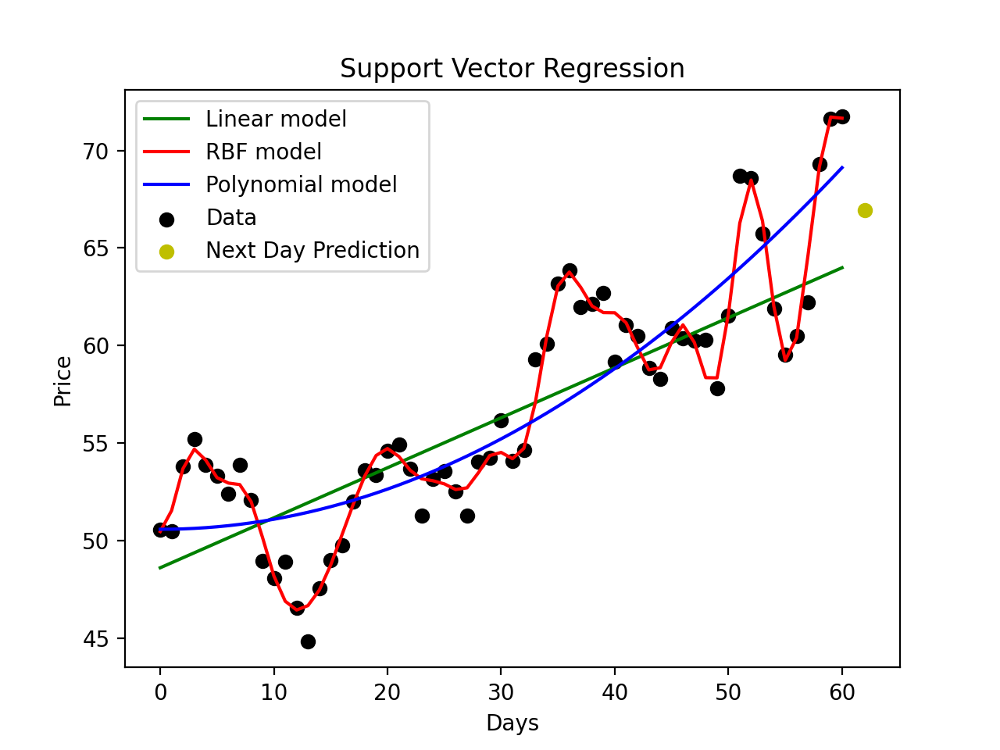

# StockSwingPredictor
The StockSwingPredictor (SSP) is a WIP tool that will predict stock price swings. Implemented in Python as apart of my Allegheny College Senior Thesis.

## Running the Project
Currently you can only run the project locally. To do this ensure you have Python3 installed and then from the main directory of the project, run the command: `python3 src/ssp.py`.

## Testing the Project
To test the project locally using Pytest, simply run the command: `pytest tests`.

To test the project and generate a code coverage report, run the command: `pytest --cov=src tests/`.

### Results of Testing/Code Coverage Report:
```
collected 4 items

tests/test_scraper.py ....                                                                                                                                                                           [100%]

---------- coverage: platform darwin, python 3.9.0-final-0 -----------
Name             Stmts   Miss  Cover
------------------------------------
src/cml.py          39     39     0%
src/scraper.py      29      0   100%
src/ssp.py           9      9     0%
------------------------------------
TOTAL               77     48    38%


============================================================================================ 4 passed in 13.57s ============================================================================================
```

### Preliminary Prediction Results
*The results of running different ML models on sample data of the DKNG stock:*



*The results of running different ML models on sample data of the DKNG stock:*


After running these models with different stock data sets, the SVR (RBF kernel) and KNR models seems to be by far the most accurate. The predictions made by the LR, EN, and LASSO models seem to be the same. With this, predictions from the SVR-RBF, KNR, LR, and SVR-POLY will be used to generate the program's final price swing prediction.
